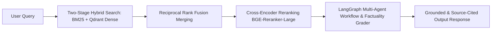

<h1 align="center">Hi, I'm Durga Prasad Jaiswal</h1>
<h3 align="center">GenAI Engineer • Production RAG Systems • Agentic AI • LLM Application Development</h3>

  
  
  
  

  

  <b>4+ Production RAG Systems</b> &nbsp;|&nbsp; 
  <b>40% Retrieval Accuracy Gain</b> (Hybrid + Cross-Encoder) &nbsp;|&nbsp; 
  <b>Published AI Research Paper</b>

---

# About Me

I'm a **GenAI Engineer** specializing in **production-grade Retrieval-Augmented Generation (RAG)** systems, **Agentic AI**, and scalable backend engineering.

I build enterprise AI applications that are **grounded, auditable, source-cited, deterministic, and production-ready** rather than simple chatbot demos.

My work focuses on combining **LLMs, Hybrid Retrieval, LangGraph workflows, FastAPI microservices, vector databases, and intelligent orchestration** to solve real-world business problems across healthcare, finance, legal-tech, and enterprise automation.

Currently working at **Mobcoder AI**, where I design production AI systems involving multi-agent orchestration, hybrid retrieval pipelines, deterministic evaluation, and scalable backend services.

### Current Focus

- Production RAG Pipelines
- Agentic AI & LangGraph Workflows
- Multi-Agent Systems & Orchestration
- Hybrid Search (BM25 + Vector) & Cross-Encoder Reranking
- Enterprise AI Architecture & Deterministic Evaluation
- LLM Guardrails & Hallucination Mitigation
- FastAPI & Django Backend Microservices

---

# Tech Stack & Badges

### Languages & Backend Frameworks

### GenAI, RAG & Agentic Frameworks

### Databases & Asynchronous Architecture

### DevOps & ML Tools

---

# Production RAG Architecture Flow

---

# Work Experience

## GenAI Engineer — Mobcoder AI
**Jan 2026 – Present**

- Developed deterministic LLM response systems with strict safety guardrails and grounding strategies, reducing hallucination risk in healthcare and enterprise environments.
- Designed advanced Hybrid Search architectures (Dense + Sparse Retrieval) integrated with Cross-Encoder reranking for improved Top-K retrieval precision.
- Built scalable production RAG pipelines involving semantic chunking, embedding generation, vector indexing, metadata extraction, and enterprise document retrieval.
- Deployed event-driven microservices using **Celery, Redis, and Docker**, enabling asynchronous AI workloads while maintaining sub-second API latency.
- Integrated Vision OCR pipelines with backend AI workflows for intelligent document understanding.

---

## AI/ML Engineer Intern — Apana Time Tech Solutions
**Oct 2025 – Jan 2026**

- Developed scalable backend REST APIs using Python and FastAPI.
- Implemented secure Role-Based Access Control (RBAC) and authentication.
- Designed optimized SQLAlchemy database schemas for efficient storage and reporting.
- Collaborated with frontend teams to integrate real-time dashboards and workflow automation.

---

# Featured Projects

## Intelligent Clinical Triage & Decision Support System

A production-grade healthcare AI platform built using **Agentic AI, LangGraph, FastAPI, RAG, Vision AI, and event-driven microservices** to automate clinical triage and support medical decision-making.

- **Repository**: [Clinical Triage RAG System](https://github.com/Dpjaiswal)

### Key Highlights

- Architected a distributed digital triage platform with **stateful routing** and **tokenized access**, automating healthcare data ingestion while reducing manual administrative effort.
- Implemented a **Vision OCR parsing pipeline** that extracts unstructured medical image data and serializes it into validated JSON schemas, significantly accelerating downstream validation.
- Engineered a **multi-agent LangGraph workflow** utilizing constrained state machines for automated clinical decision support and deterministic severity scoring.
- Developed a localized **Retrieval-Augmented Generation (RAG)** system using **1024-dimensional embeddings** to accurately map unstructured clinical symptoms into standardized diagnostic codes.
- Orchestrated an **event-driven microservices architecture** with strict LLM guardrails for asynchronous ML processing while maintaining **sub-second API latency** and minimizing hallucinations.

---

## Hybrid Financial RAG Pipeline

Enterprise-grade Financial AI system designed for auditability, grounded reasoning, deterministic evaluation, and intelligent financial document analysis.

- **Repository**: [Hybrid Financial RAG](https://github.com/Dpjaiswal)

### Key Highlights

- Architected a **stateful Financial RAG platform** using LangGraph and FastAPI, orchestrating **8 specialized AI Intent Tools** for intelligent SEC filing analysis.
- Engineered a **Two-Stage Hybrid Search** pipeline combining **Dense Vector Search (Qdrant)** and **BM25 Sparse Retrieval**, followed by **Cross-Encoder Reranking**, improving Top-10 retrieval accuracy for financial tables.
- Developed a deterministic mathematical evaluation layer to verify generated financial calculations, eliminating dependency on subjective **LLM-as-a-Judge** approaches.
- Designed heuristic **Regex-based fallback mechanisms** for LLM intent routing, preventing JSON parsing failures and ensuring uninterrupted production execution.
- Implemented **Server-Sent Events (SSE)** streaming architecture delivering sub-second Time-to-First-Token (TTFT) with persistent PostgreSQL state management.

---

## Legal Judgment RAG System

Enterprise Legal AI system capable of answering legal questions strictly from retrieved legal judgments with complete source grounding.

- **Repository**: [Legal Judgment RAG](https://github.com/Dpjaiswal)

### Key Highlights

- Built a Legal AI platform using **FastAPI** and **React**, reducing overall query response latency through Groq-powered LLM inference.
- Engineered an advanced **Hybrid Retrieval** pipeline using **Qdrant**, TF-IDF scoring, Reciprocal Rank Fusion (RRF), and Cross-Encoder reranking.
- Developed an automated NLP ingestion pipeline with coherence filtering, improving indexed document quality before vectorization.
- Enforced **12-Factor Application Architecture** with zero hardcoded configurations for production-ready deployments.
- Built a responsive Legal Chat interface featuring real-time latency monitoring and source transparency to improve user trust.

---

## AI-Powered Personalized Learning & Skill Gap Navigator

A complete AI career guidance platform that combines Machine Learning, Resume Intelligence, Recommendation Systems, and RAG.

- **Repository**: [AI Learning Navigator](https://github.com/Dpjaiswal)

---

## AI for Real-Time Translation of Sign Language

Published research project focused on improving communication accessibility through Computer Vision.

- **Research Paper**: [View Published IJAMRED Paper](https://ijamred.com/volume1/issue4/IJAMRED-V1I4P56.pdf)

---

# Research Publication

## AI for Real-Time Translation of Sign Language

Published in: **International Journal of Advanced Multidisciplinary Research and Educational Development (IJAMRED)**

**Paper Link**: [https://ijamred.com/volume1/issue4/IJAMRED-V1I4P56.pdf](https://ijamred.com/volume1/issue4/IJAMRED-V1I4P56.pdf)

---

# GitHub Analytics

  
  

  

---

# Contribution Graph

  

---

# Current Learning

- Agentic AI Systems & Multi-Agent Orchestration
- LangGraph Production Workflows & Stateful Routing
- Enterprise RAG Architectures & Cross-Encoder Optimization
- Deterministic AI Evaluation & Hallucination Guardrails
- Distributed AI Microservices & Event-Driven Systems

---

# 2026 Goals

- Build enterprise-scale AI systems used in production.
- Contribute to Open Source GenAI projects.
- Publish additional AI research papers.
- Deepen expertise in Agentic AI and Multi-Agent architectures.
- Design highly reliable RAG systems with deterministic evaluation.

---

# Let's Connect

  
  
  

---

  <b>Building reliable AI systems — Grounded • Auditable • Production Ready</b>

