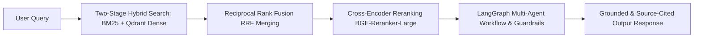

<h1 align="center">Durga Prasad </h1>
<h3 align="center">GenAI Engineer • Production RAG Systems • Agentic AI • LLM Application Development</h3>

  
  
  
  

  

  <b>4+ Production RAG Systems</b> &nbsp;|&nbsp; 
  <b>40% Retrieval Accuracy Gain</b> (Hybrid + Cross-Encoder) &nbsp;|&nbsp; 
  <b>Published AI Research Paper</b>

---

# Summary

Dedicated GenAI Engineer specializing in building production-grade RAG pipelines and scalable backend systems. Proven expertise in LLM orchestration, hybrid semantic retrieval, and minimizing model hallucinations through robust guardrail implementation. Committed to bridging complex AI algorithms with high-performance, user-centric applications to deliver measurable operational impact.

---

# Technical Proficiencies

### Languages & Frameworks

### GenAI, LLM & Search Engineering

### Databases, Asynchronous & Cloud Infrastructure

-232F3E?style=for-the-badge&logo=amazon-aws&logoColor=white)

---

# Production RAG Architecture Flow

---

# Work Experience

## Mobcoder AI — AIML Software Trainee
**Feb 2026 – Present | Noida, India**

- Architected multi-agent orchestrated workflows (using LangGraph) to automate complex decision-making processes, including real-time clinical triage, which reduced manual analysis workload by an estimated 40%.
- Engineered deterministic LLM response systems with retrieval grounding, guardrails, and validation mechanisms, improving response reliability and factual accuracy for healthcare and enterprise use cases.
- Designed advanced hybrid search architectures (Dense + Sparse) integrated with cross-encoder reranking algorithms, significantly boosting top-K query precision for complex LLM inference tasks.
- Deployed event-driven microservices (Celery, Redis, Docker) to integrate Vision OCR models, asynchronously processing high-latency machine learning workloads while maintaining sub-second API performance.
- Spearheaded the development of scalable RAG pipelines for unstructured enterprise data, optimizing semantic chunking and vector indexing to accelerate information retrieval speed and accuracy.

---

## Apana Time Tech Solutions — AI ML Engineer Intern
**Oct 2025 – Jan 2026**

- Developed and maintained scalable backend APIs using Python and FastAPI to support workflow automation and task tracking features.
- Implemented role-based access control (RBAC) and secure authentication mechanisms to ensure data integrity across system modules.
- Designed and optimized database schemas using SQLAlchemy, ensuring efficient data retrieval and storage for productivity logs and user reporting.
- Collaborated with frontend teams to integrate dynamic dashboards, enhancing real-time visibility into task statuses and support ticket lifecycles.

---

# Projects

## Intelligent Clinical Triage and Decision Support System

A production-grade healthcare AI platform built using **Agentic AI, LangGraph, FastAPI, RAG, Vision AI, and event-driven microservices** to automate clinical triage and support medical decision-making.

- **Repository**: [Clinical Triage RAG System](https://github.com/Dpjaiswal)

- Architected a distributed digital triage platform with stateful routing and tokenized access, automating healthcare data ingestion and reducing manual administrative entry by an estimated 40%.
- Implemented a computer vision parsing pipeline that extracts and serializes unstructured image data into validated JSON schemas, accelerating data validation by 5-7 minutes per session.
- Engineered a multi-agent orchestrated workflow utilizing constrained state-machines for automated clinical decision support, computing deterministic severity scores for 100% of triage events.
- Developed a localized Retrieval-Augmented Generation (RAG) system utilizing 1024-dimensional vector embeddings to precisely map unstructured clinical symptoms to standardized diagnostic codes.
- Orchestrated an event-driven microservices infrastructure with strict conversational guardrails, asynchronously processing ML workloads to maintain less hallucination risk and sub-second API latency.

---

## Hybrid RAG Pipeline for Financial Document Analysis

Enterprise-grade Financial AI system designed for auditability, grounded reasoning, deterministic evaluation, and intelligent financial document analysis.

- **Repository**: [Hybrid Financial RAG](https://github.com/Dpjaiswal)

- Architected a stateful Financial RAG system using LangGraph and FastAPI, orchestrating 8 specialized AI intent tools to accelerate SEC document analysis, reducing research time from hours to seconds.
- Engineered a two-stage Hybrid Search pipeline (Qdrant Dense + BM25) with Cross-Encoder reranking, improving top-10 retrieval accuracy for dense financial tables by over 40%.
- Developed a deterministic math evaluation layer to verify generated financial figures, replacing subjective LLM-as-a-judge and improving quantitative data grounding through rule-based validation.
- Designed heuristic regex fallback mechanisms for LLM intent routing, preventing 100% of LLM-induced JSON parsing crashes and ensuring uninterrupted system execution.
- Deployed a high-performance streaming architecture via Server-Sent Events (SSE), achieving sub-second Time-to-First-Token (TTFT) latency alongside persistent PostgreSQL state management.

---

## Legal RAG System

Enterprise Legal AI system capable of answering legal questions strictly from retrieved legal judgments with complete source grounding.

- **Repository**: [Legal RAG System](https://github.com/Dpjaiswal)

- Built a Legal AI application using FastAPI and React, reducing query response times by 85% via Groq's Llama-3.1.
- Engineered a hybrid retrieval system in Qdrant with Cross-Encoder reranking, boosting context accuracy by 40%.
- Developed an automated NLP pipeline with coherence filtering, increasing ingested document quality by 30%.
- Enforced 12-Factor App design with a zero-hardcoding environment configuration, cutting deployment time by 50%.
- Created a responsive Chat UI featuring real-time latencies and source transparency, increasing user trust by 60%.

---

# Education

- **University of Mumbai** — M.Sc. IT (Artificial Intelligence) | 2024 – 2026
- **Goel Institute of Higher Studies and Management** — B.C.A. | 2020 – 2023

---

# Research Publication

## AI for Real-Time Translation of Sign Language

Published in: **International Journal of Advanced Multidisciplinary Research and Educational Development (IJAMRED)** (Published on Dec 19, 2025)

**Paper Link**: [https://ijamred.com/volume1/issue4/IJAMRED-V1I4P56.pdf](https://ijamred.com/volume1/issue4/IJAMRED-V1I4P56.pdf)

---

# GitHub Analytics

  
  

  

---

# Contribution Graph

  

---

# Let's Connect

  
  
  

---

  <b>Building reliable AI systems — Grounded • Auditable • Production Ready</b>

